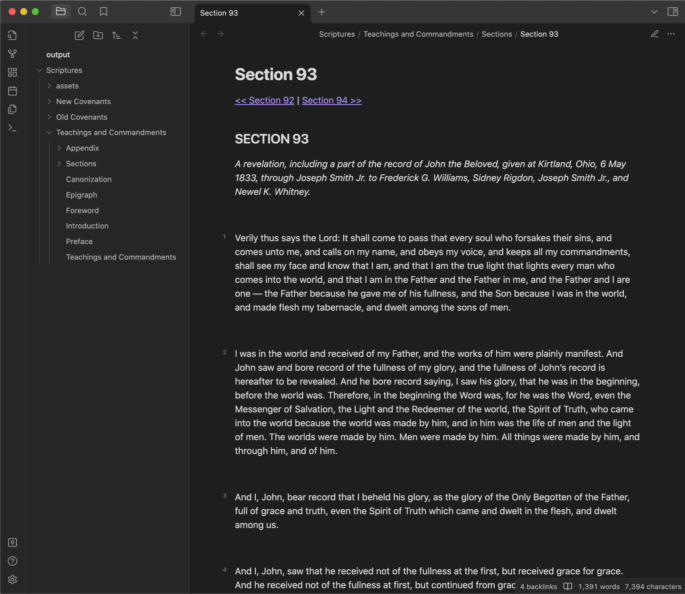
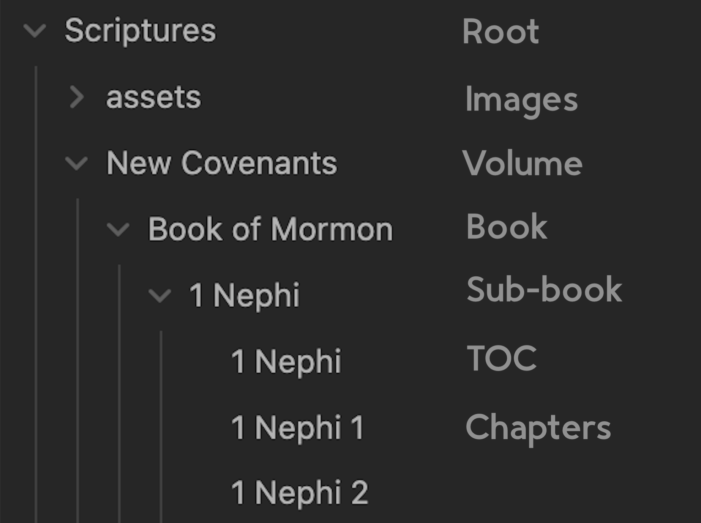

# Markdown Restoration Edition Scriptures


This project generates the Restoration Edition scriptures in Markdown by requesting each relevant HTML page first from the cache, and then from www.scriptures.info if the page isn't yet cached, and converting the relevant portions to Markdown.

It supports the following link outputs:
- Wikilinks
  - short format: `[[Note Name]]`
  - relative format: `[[../../Note Name]]`
- Markdown links
  - short format: `[Note Name](Note%20Name.md)`
  - relative format: `[Note Name](../../Note%20Name.md)`

The project contains a preloaded cache of the HTML files and their corresponding Markdown files, so it isn't necessary to run the program to obtain the generated Markdown. The cache is up to date with [Text V1.383 - 2023.08.30](https://scriptures.info/scriptures/changetracking)


## Getting Started
To download the Markdown files, download the appropriate Markdown zip file from [Releases](https://github.com/colossatr0n/markdown-restoration-edition-scriptures/releases). 

After downloading, Obsidian users can:
- Copy the `Scriptures` directory to your vault or open it as a vault.
- Have the verse numbers appear at the side of the verse as in the screenshot above by adding the CSS file in `resources/verses.css` to `<vault>/.obsidian/snippets/` and by enabling the CSS snippet in `Obsidian > Settings > Appearance > CSS Snippets`.

## Generating the Files
This program is capable of generating a large amount of traffic since it can request most of the pages on www.scriptures.info. Please be courteous and cautious in this regard. 

The program defaults to using to the cache files in `./cache` and will only make HTTP requests when it detects a missing cache file. If you need to refetch the HTML files, delete the files in `./cache` before running the program.

### How to Run
```sh
# cd into project root directory and run
python obsidian_re_scriptures.py 
```
Generated output will be located in the `./output` directory unless a different directory is specified with `-o <output_dir>`.

Relative paths in links can be specified with `--rel-links`, otherwise short paths will be used.

The link type can be specified with `--link-type` with either `wikilinks` or `markdown`. The default is `wikilinks`.

A reading list can be output with `--reading-list`, which will look like the following:
```markdown
- [ ] Old Covenants
    - [ ] Old Covenants
    - [ ] Foreword
    - [ ] Canonization
    - [ ] Preface
    - [ ] Genesis
        - [ ] Genesis 1
        ...
```


## Output Description


The Markdown file structure is as follows:
- Each chapter is a single file, with each chapter in a directory corresponding to its book. 
- Each book directory contains a table of contents.
- Each book is within a directory corresponding to its volume.
- Each volume has a table of contents.
- Images are stored in the assets directory.

Each file, where applicable, contains next/previous links at the top of the page. Links are generated where necessary such as in the TOC, Glossary, etc.

## Why Not Use Other Methods to Obtain the Markdown?
There are other methods of turning the RE scriptures into regular Markdown such as:
- EPUB -> Pandoc to MD
- EPUB -> Calibre to HTML -> Pandoc to MD
- HTML -> Markdown Python library

I've tried each method in an assortment of different ways, each way producing either unsatisfactory results or a convoluted process that involves an excess amount of manual work and programs that aren't conducive for widespread use.

This projects aims to simplify that entire process.
