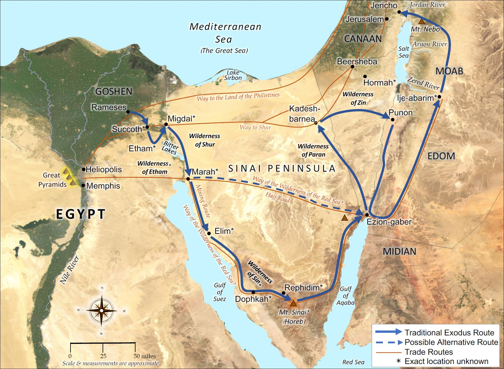
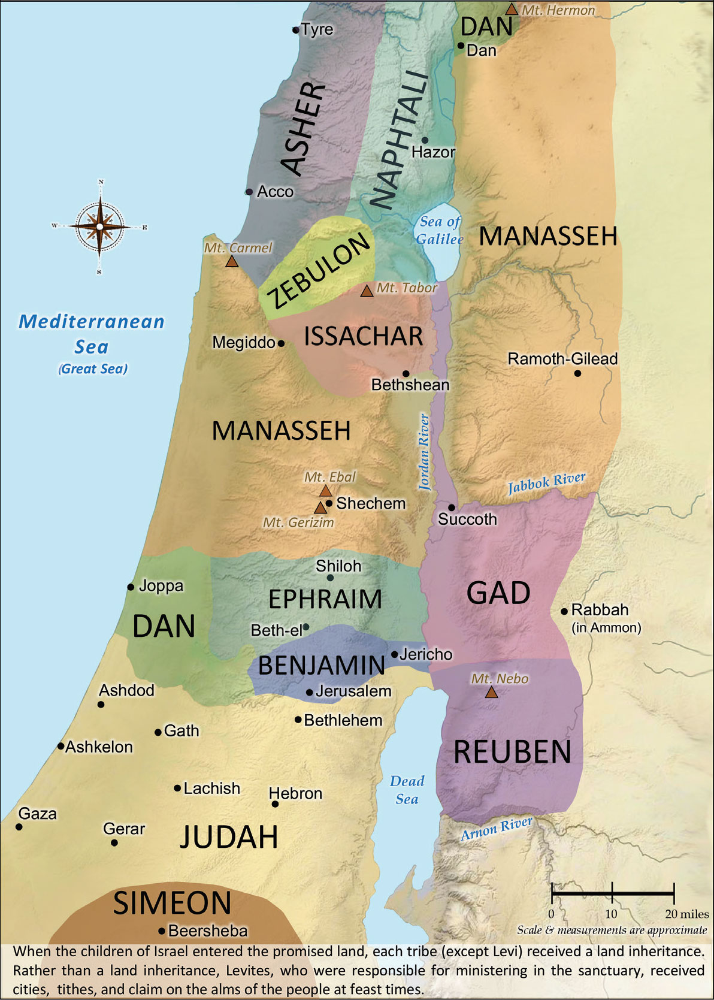
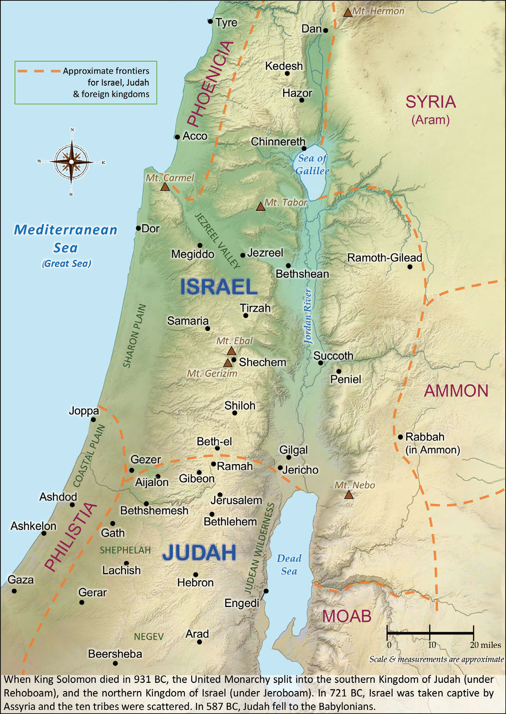
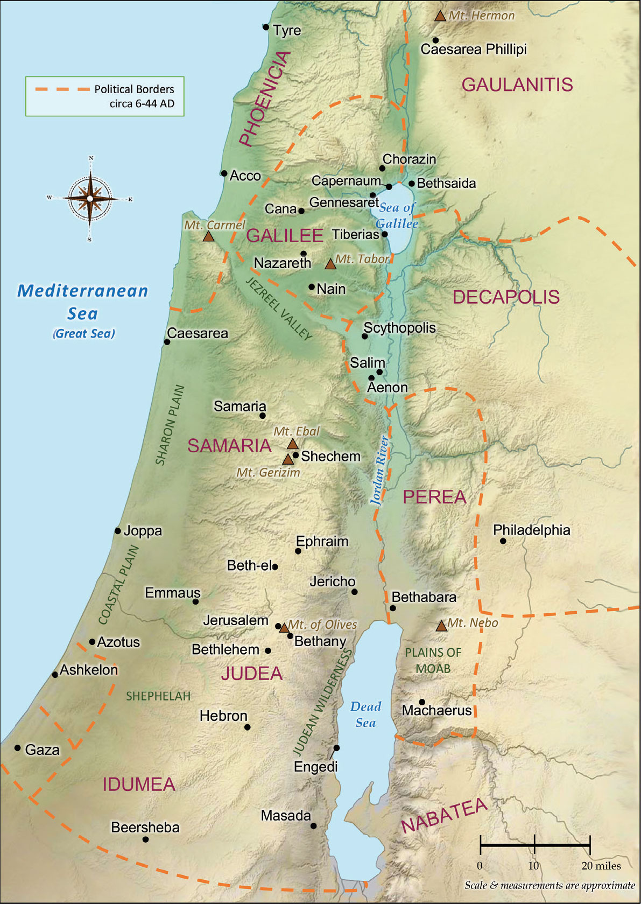
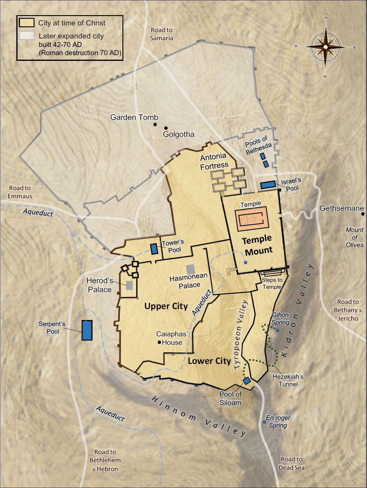
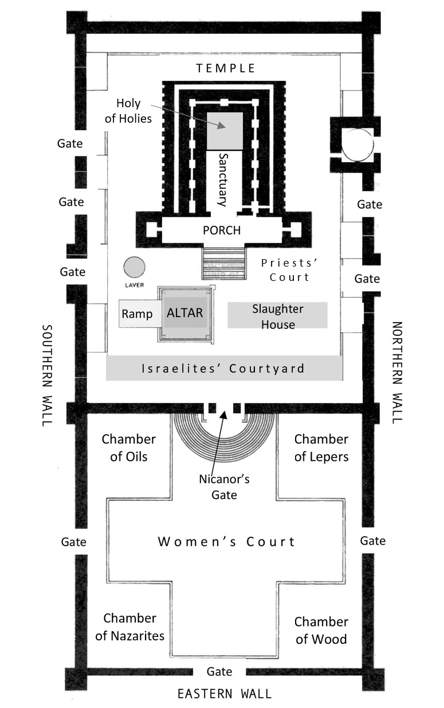
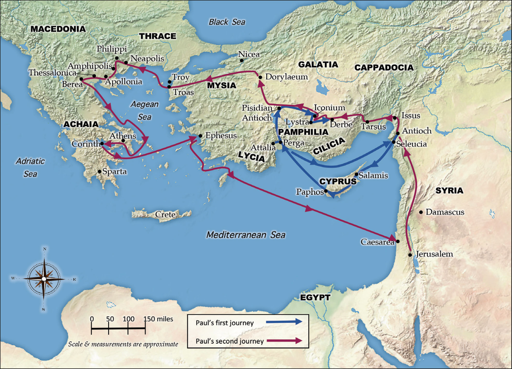
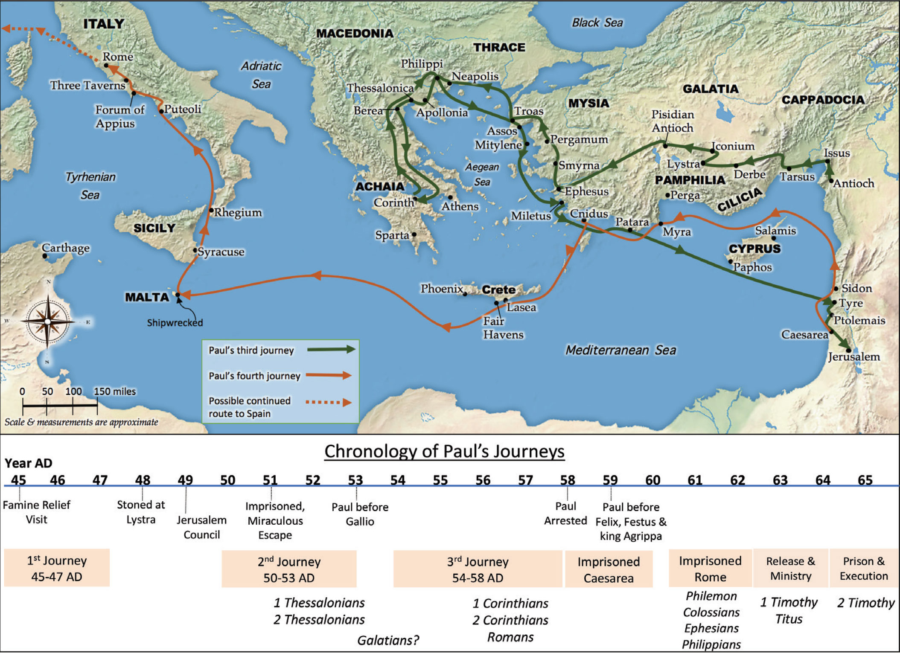
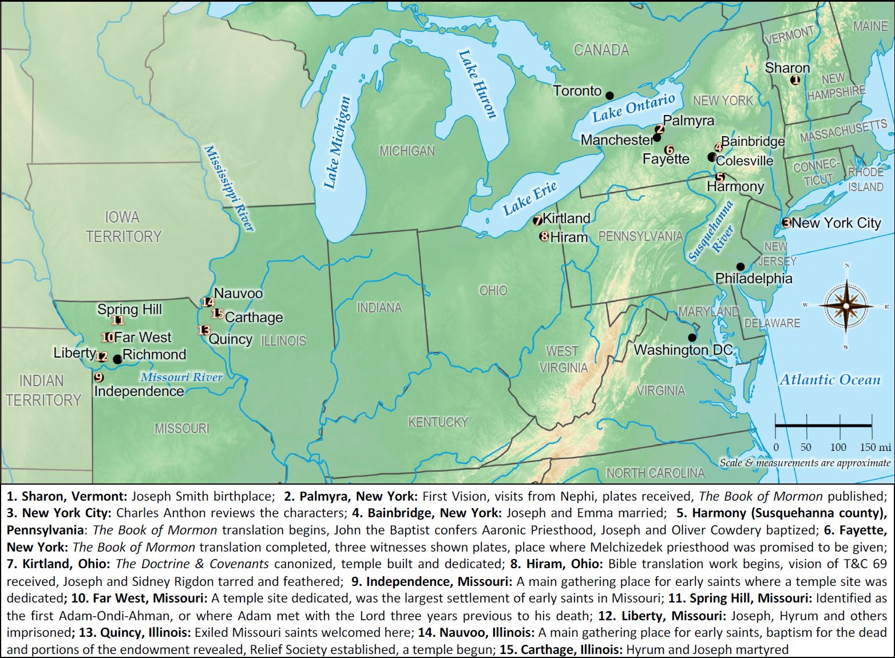

[<< Timeline of the Fathers](Timeline%20of%20the%20Fathers.md)  |  

### MAPS
#### Israel's Exodus from Egypt to Canaan

#### Israelite Tribal Allotments

#### Kingdoms of Israel & Judah (circa 930 B.C.)

#### Holy Land in New Testament Times

#### Jerusalem at the Time of Christ

#### Temple Complex at the Time of Christ

#### Paul's First and Second Missionary Journeys

#### Paul's Third and Fourth Journeys

#### Early Restoration Sites
